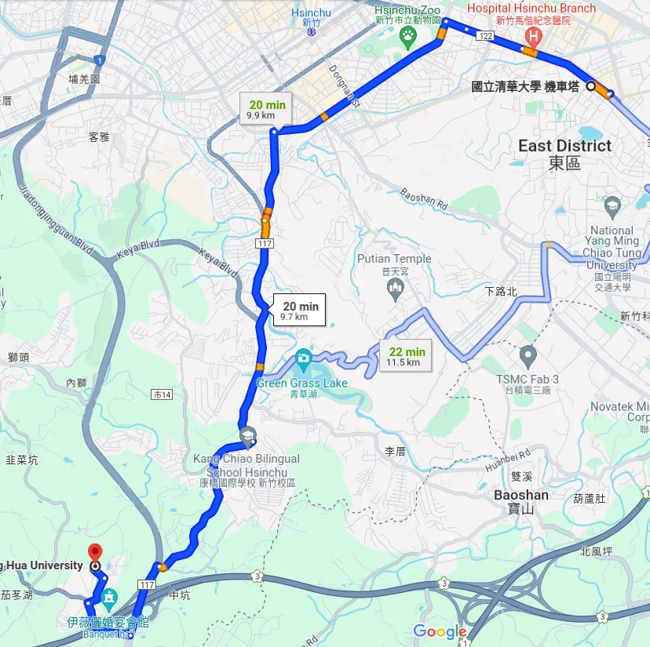
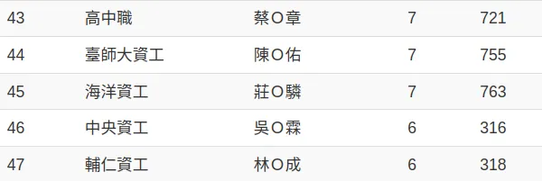
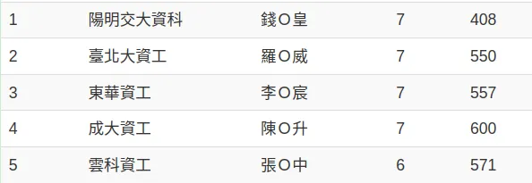
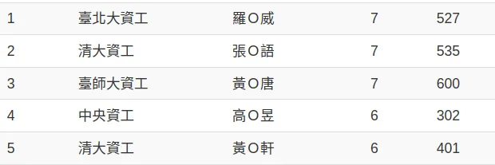

### 考生背景

114CS的普通大四生，因為快要畢業了，剛好蹭一下大學生免報名費的考試，血賺🈵

NCPC 0次通過校內初選，0次站上 ICPC Regional，因此可以以一般人的角度分享準備CPE，畢竟那些競技程式出身的選手都是切菜通關的，可能無法了解民間疾苦😢

---

### 考試心得

我參加的是因為技術問題被調整時間的 2024/04/23 場次（原3/26場）。原本三月的場次因為題目發出時即顯示答案，主辦單位就放大家回家並另覓時間。老實說真的蠻搞人心態的，因為距離我最近的陽交大學考場早早額滿，所以我報名的是中華大學場，也因此東區到香山這段十公里的路要走四次🙃

考試完全在（也只能使用）一個 self-maintained 的程式「瘋狂程設」上進行，這程式的使用者體驗會讓正常人變瘋狂（開玩笑

1. 題序 \
題目是Uva Problem Set中的 pdf file，有些被換成全影像檔有些是文字檔。全影像檔在正常的放大倍率下居然就會糊糊的了(還是其實是我眼睛太差🥵)。至於題目敘述的部分，相信Uva的某些題目也算是惡名昭彰，專門講一些臭又長的故事來浪費時間，有些甚至沒有提供變數的量級，讓你無從估算要使用什麼等級的時間複雜度的演算法（通靈 \
✅ 3星 / 5星，畢竟除了解析度，也不是主辦單位可以控制的

2. 編輯器 \
瘋狂程設內建的編輯器基本上可以想像成有顏色的記事本，沒有IntelliSense，撰寫起來痛苦程度是數一數二的，可能只比面試時在google docs上寫程式要舒服而已。因此不建議使用太好的 coding style，命名盡量能短就短，減少打錯字的機會。 \
✅ 1.5星 / 5星，畢竟現在連網頁版的編輯器都可以做到很絲滑了，希望這個程式能再進步點吧QQ

3. 編譯器 \
因為這次的題目沒有一些精度，大數題目，所以沒有體驗到Python編起來的感覺。MinGW是提供c++11的標準，算是堪用，但有時候還是會有些老舊和不順手的地方，像是auto-type parameter 和標準命名空間中的很多函式都不能使用了。 \
✅ 3.5星 / 5星

4. 執行，偵錯，繳交 \
給自訂測資甚至可以直接跟Solution做正解比對，比對也會Highlight不一樣的地方，算是極度友善。邊緣測資和大測資如果可以自己生出來，就可以直接在繳交前判斷會不會WA, TLE \
✅ 5星 / 5星，光是跟正解比對就值得給5星。

其他的像是考場人員都非常友善，冷氣也夠涼，中華大學也蠻漂亮的，五星斜線五星💯。

附帶一題，也不能對這個考試太苛責，畢竟政府好像沒有給主辦方什麼支援，聽說很多東西也都是幾個大學教授+他們的研究生做功德來的。

---

### 考試準備

:::info

每次的考試共七題，一顆兩顆星四或五題，三顆四顆星二或三題，五星極稀有。

:::

 - 本科生（修過資料結構，演算法，會基本的離散數學）\
目標是專業級（四至五題），刷完一星必考49題後二星三星隨機刷個60題應該就可以過關了。需要注意的是三星的題目偶爾需要一些競技程式的技巧（質數篩法，線段樹，基礎圖論）才能通過，如果沒有時間學習的話可以跳過，把握住一二星的題目依舊可以專業級。 
>但是三顆星中的基礎動態規劃，STL資料結構，DFS BFS Similar等問題還是要能夠解決會比較穩定。而這些也比較會是面試題容易出現的題型（？ 順便增加面試題經驗💪

 - 本科生（接觸過初中階的競技程式設計）\
目標是專家級（六至七題），刷三星中比較難的（可照solved數量排序）和四星題。四星題的難度跨越很大，並且因為考試是要裸寫不能攜帶模板和查資料，部份的模板要會寫簡單版本的（e.g. 網路流題目EK Algorithm 會比 Dinic, ISAP更容易在考試中寫出）
坐六望七，能不能七題取決於四星題的難度。
>其實如果時間不趕的話可以多報名幾場，總會遇到幾次是考四星題中簡單的題目，就可以獲得七題。

 - 本科生（中高階競技程式設計）\
恭喜你，可以直接裸考，這篇也可以右上角叉叉😆
記得考前背一下不熟的模板即可

 - 非本科生 \
取決於你使用程式解題的熟悉度，可以先從簡單的題目下手，慢慢訓練。不過排行榜上很多人也不是本科的，因此程式解題和是不是CS學生沒有太大關係，熟能生巧💯

---

### 其他學習資源

老實講刷題庫的效益還是最高的，畢竟考試的題目大多數從題庫出。但Uva的題面很冗，輸入輸出又常常搞得很複雜，有些甚至網路上沒有題解，練習會練到很躁。（這我🥲四星只練了21題，基本靠運氣在考試的）

因此還是推薦幾個可以循序漸進學習的好去處（Uva真的有點像時代的眼淚了）

  

    

  

  

    <h2 class="!p0 !m0 !text-[1rem] sm:!text-[1.25rem] !font-700 underline"><a href="https://usaco.guide/">USACO Guide</a></h2>
    
✒︎ A free collection of curated, high-quality resources
to take you from Bronze to Platinum and beyond.

  

USACO Guide是前世界冠軍Benq維護的開源教學，專門訓練美國高中生參加資訊奧林匹亞競賽。這個教學有將主題依據難易度分類，非常新手友善。觀念教學完後還有例題可以搭配練習，非常不錯。感覺練到金色（不用練完）就足夠Ace CPE了

  

    

  

  

    <h2 class="!p0 !m0 !text-[1rem] sm:!text-[1.25rem] !font-700 underline"><a href="https://oi-wiki.org/">OI Wiki</a></h2>
    
✒︎ OI Wiki 致力於成為一個免費開放且持續更新的 程式設計競賽 (competitive programming) 知識整合站點。

  

OI Wiki是一個簡體中文的開源百科，如果閱讀簡中沒有障礙的話也是非常不錯的資源，分類都非常清楚，也有教學和練習題。如果閱讀簡中有障礙的話可以參考 [CP-Algorithm](https://cp-algorithms.com/index.html)，內容也是足夠充分了。

其他如[GFG](https://www.geeksforgeeks.org/)，[TopCoder](https://www.topcoder.com/)，[CS Academy](https://csacademy.com/) 等也非常豐富，不過因為我不是競技程式選手，這些也不是很熟，就姑且推薦上面兩個最熱門的項目就好。

---

### 其他練題資源

再講一次～**刷題庫**的效益還是最高的，畢竟考試的題目大多數從題庫出。但但但如果寫到很躁，可以寫兩個有提供**題解**的網站

  

    

  

  

    <h2 class="!p0 !m0 !text-[1rem] sm:!text-[1.25rem] !font-700 underline"><a href="https://atcoder.jp/">AtCoder</a></h2>
    
✒︎ AtCoder（日語：アットコーダー）是以舉辦程序設計競賽為主要業務的公司，口號是「解決了！我想告訴全世界。（日語：解けた！を世界に届けたい。）」

  

AtCoder 是私心最推最推的一個網站，由日本人創辦。題目通常短又有水準，可以搭配[Problems](https://kenkoooo.com/atcoder/#/table/)使用，裡面的題目幾乎都有題解，可以快速建立一些初階競技程式的技巧（對於CPE有幫助）也可以看到別的高手寫的程式碼，學一些小技巧 (e.g. [把線段樹壓到緊繃的短碼人](https://atcoder.jp/contests/abc343/submissions/50804601))

  

    

  

  

    <h2 class="!p0 !m0 !text-[1rem] sm:!text-[1.25rem] !font-700 underline"><a href="https://codeforces.com/">Codeforces</a></h2>
    
✒︎ Codeforces (Russian: Коудфорсес) is a website that hosts competitive programming contests. It is maintained by a group of competitive programmers from ITMO University led by Mikhail Mirzayanov.

  

Codeforces 是目前世界上最活躍的競賽網站，有許多好題目可以寫，並且也都有題解，查看他人提交。但但但⚠️裡面題目有一定比例的思維題（靠觀察特性，而非套用經典的資料結構演算法來解題）雖然有助於建構競技程式設計的能力，但是對於CPE的幫助不太大，因為Uva的題目更偏向使用經典技巧的題目。推薦可以寫Educational Round的題目，因為是官方團隊出題，思維題會相對來得少。

#### Bonus

  

    

  

  

    <h2 class="!p0 !m0 !text-[1rem] sm:!text-[1.25rem] !font-700 underline"><a href="https://www.luogu.com.cn/training/9391">洛谷</a></h2>
    
✒︎ 這份題單包含了競賽中，從入門，到 NOI、ICPC 等競賽的常用演算法和技巧，配以典型的例題用以練手，大部分是範本題和經典題，可以幫助瞭解演算法競賽中有哪些知識點，建構起知識框架。

  

洛谷是目前中國最大的解題網站，如果你閱讀簡體中文沒有障礙的話可以嘗試看看，裡面的題目有難度分級，題型分類，充足的題解，豐富的題單，超快的裁判速度（1~2秒內會有判定結果），功能也極多（提供改網站主題，滿足**動漫豚**，**韓團豚**，**VT豚**的需求，像我曾經主題是Kim Chaewon的臉😆）。要不是因為簡體中文看得比英文慢，這個競賽網站絕對值得當成主力的練題遊樂場🥲

---

### 後記

其實客觀來說，這個考試是真的存在許多問題的。大學生的考試居然是考題庫，鑑別度可能比給高中生考的APCS要差得多了。

>但也不能真的跟APCS比，畢竟政府投得錢也差很多😆，要求每次考試都出原創題目真的太嚴格了😵‍💫。

並且，其實他們大可以不用堅持使用自己開發的程式來做裁判，畢竟在經費不足的情況下還要維持軟體維護是不切實際的。使用開源的Judge系統搭配本地的編譯器編輯器，不但比較符合現代化考試的樣貌，維護起來也比較輕鬆。

最後，就是顆星的分級不一定能真實反應題目難度。[4/23這場考試](https://cpe.cse.nsysu.edu.tw/cpe/scoreboard/2024-04-23) 依照題目的星等分配，與歷屆比是大同小異，但是達成7題的人數竟高達45人，分別是上次考試4人的11倍和上上次考試3人的15倍。

由此可知顆星的題單可能需要一些調整。看一下官方的敘述

 - 三顆星：要有好的演算法或數學方法才能解答
 - 四顆星：要有特殊的演算法或是綜合多種演算法才能解答

**好的演算法**跟**特殊的演算法**其實就沒有一個特定的標準。舉例來說，題目Inviting Politicians，需要使用bit manipulation 和 dfs pruning，被歸類在三顆星; 而Triangle Counting，一題簡單的動態規劃題卻被歸類在四顆星。也就是如果考試中真實出現這兩題的話，三顆星的題目會比四顆星的題目殺傷力要大的多，真是不可思議。

---

### 後記的後記

不過也感謝這次不太大刀的題目，讓我有機會首考通關。還是感謝主辦單位的付出，希望他們能夠辦得越來越好，也希望這篇塞了很多廢話的文章能給正在準備考試的你一點方向😶‍🌫️
