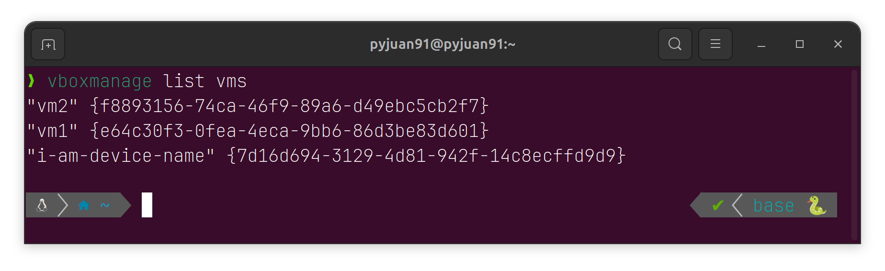

## Background ( Murmur )

Oracle VirtualBox is **incredibly handy** (no, just cuz it's free) for running multiple simple machines on a single device. 

Since our lab at Academia Sinica is currently experimenting with handling several network traffic generators, we’ve installed multiple VirtualBox instances on our Ubuntu desktops.

However, since our Ubuntu desktops need to be accessed remotely through a secure gateway, using typical remote desktop apps has proven tricky (SSH tunneling with Remmina tends to fail pretty easily).

Reluctantly, we had to figure out a way to manage our VirtualBox machines via the command line interface. That’s when we discovered VBoxManage and the guestcontrol feature.

## Step-by-step Guide

There are so many frustrating pitfalls when setting up this technique, so here’s a step-by-step guide to help you avoid wasting your time! (Though, honestly, our time feels pretty worthless sometimes. ☺️)

### Prerequisites

After installing VirtualBox, make sure the necessary tools are set up by checking if these packages are installed:

```sh
sudo add-apt-repository universe
sudo apt install liblzf1 libqt6help6 libqt6statemachine6 libqt6xml6t64 libtpms0
```

If something goes wrong and it fails, you might need to fix any broken packages with this:

```sh
sudo apt --fix-broken install
```

### Installation

Next, we need to check whether the virtual machine is set up to accept control commands (or not).

Type this on your **host (not your virtual machine)**.

```sh
VBoxManage guestproperty get "i-am-device-name"
```

You should see the version number pop up. (Just ignore any fail messages for now.)


If the version number doesn’t show up, you’ll need to install guestcontrol on the **guest (virtual machine)** itself.

```sh
VBoxControl --version
```

And follow the returning info.


Success! We can now control the guest machine using just the command line from the host!

### Control

**List virtual machines.**

```sh
vboxmanage list vms
```



**Boot up certain virtual machines.**

```sh
vboxmanage startvm "i-am-device-name"
```


**Check every guest machine's status**

```sh
vboxmanage list vms --long | grep -e "Name:" -e "State:"
```


### Core Execution

**Copy a file (or an entire directory recursively) from the host to the guest machine**

```sh
VBoxManage guestcontrol "i-am-device-name" copyto --target-directory "/home/i-am-user-name/test.cc" "/home/pyjuan91/test.cc" --username i-am-user-name --password 123456
```


**PWD or LS or CD command**

```sh
VBoxManage guestcontrol "i-am-device-name" run --exe "/bin/ls" --username i-am-user-name --password 123456 --wait-stdout -- "/home/i-am-user-name"
```


> You can find the details of each argument in Oracle’s official documentation. (Or, if you’re feeling adventurous, just observe our command and figure it out by analogy!)


<p class="text-3xl font-bold">
  We can see now test.cc is in the guest machine!
</p>

**Download GNU c++ compiler**
Note that if you want to run **sudo** command, you have to write in shellscript format.

```sh
VBoxManage guestcontrol "i-am-device-name" run --exe "/bin/sh" --username i-am-user-name --password 123456 --wait-stdout -- -c "echo '123456' | sudo -S apt install build-essential -y"
```


**GCC/G++ Path**

```sh
VBoxManage guestcontrol "i-am-device-name" run --exe "/bin/which" --username i-am-user-name --password 123456 --wait-stdout -- "g++"
```


**Compile and Execute cc file**

```sh
VBoxManage guestcontrol "i-am-device-name" run --exe "/usr/bin/g++" --username i-am-user-name --password 123456 --wait-stdout -- "/home/i-am-user-name/test.cc" "-o" "/home/i-am-user-name/test"
```

```sh
VBoxManage guestcontrol "i-am-device-name" run --exe "/home/i-am-user-name/test" --username i-am-user-name --password 123456 --wait-stdout
```


### Shut Down

```sh
VBoxManage controlvm "i-am-device-name" acpipowerbutton

or

VBoxManage controlvm "i-am-device-name" poweroff
```

## Wrapping Up (Sort Of)

So yeah, that’s how we’ve been taming our VirtualBox beasts. Power it off with ```acpipowerbutton``` if you’re feeling polite, or just slam it with ```poweroff``` when you’re done messing around. 

Either way, you’re now a command-line wizard—go forth and conquer those virtual machines! (Or at least fake it ‘til you make it, like us. 😉)